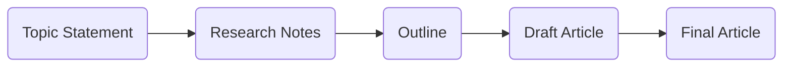

# Engineering Design Document  
**Agentic Article Generation: MVP**

---

## 1. Objectives

- **Automate** technical article creation for ML/AI/GenAI/MLOps/LLMOps topics.
- **Agentic workflow:** Each step handled by an expert-like agent: Topic selection, research, structuring, writing, review.
- **Run locally at first** (on developer machine, with manual/CLI trigger).
- **Support seamless LLM backend swaps** (OpenAI, LiteLLM, etc.) via API abstraction.
- **Robust Error Handling** and privacy-first **Security**.

---

## 2. System Overview & Workflow

```mermaid
graph TD
    Start[Trigger (manual/CLI/script)] --> A[Multi-Agent Pipeline]
    A --> B[Chief Topic Strategist]
    B --> C[Lead Researcher]
    C --> D[Structure Architect]
    D --> E[Technical Writer]
    E --> F[Peer Reviewer & Editor]
    F --> G[Final Article (Markdown)]
    G --> H[Manual Review / Publish Step]
```

Each agent receives input from the previous step, performs its own focused job, and hands off to the next stage. All content generation/analysis is performed via a unified LLM API abstraction.

## 3. Agent Roles & Their Toolsets

| Agent Name | Role | Key Tools/APIs |
|------------|------|----------------|
| Chief Topic Strategist | Selects optimal, high-impact article topic | Web search (DuckDuckGo, SerpAPI), arXiv API, RSS/news parsers, LLM |
| Lead Researcher | Gathers top references, code, summaries, insights | arXiv API, web scraping, GitHub API, LLM summarizer |
| Structure Architect | Converts research to a logical blog/article outline | LLM (prompted to outline, use templates/examples) |
| Technical Writer | Authors the article content, explains code | LLM (long-form prompt), Markdown structuring |
| Peer Reviewer & Editor | Proofs, QA, technical checks, final polish | LLM (editor prompt), (optional) grammar API, code verifier |

## 4. LLM Abstraction Layer: API Design

**Purpose:** Allow agent code to switch between LLM providers (LiteLLM, OpenAI, [future:] Ollama, Anthropic, etc.) without logic changes.

### 4.1. API Requirements

Single interface for chat completion:

- **Input:** messages, model, temperature, provider, optional params.
- **Output:** Response string (content), and optional metadata (tokens, finish_reason, etc).
- **Automatic provider dispatch:** (e.g., based on config/environment)
- **Error handling:** Timeouts, quota errors, retries, graceful fallback.
- **Security:** Never leak API keys; avoid writing sensitive prompts or keys to logs.
- **Easily extensible** for new providers.

### 4.2. Sample High-level API (Pseudo-code)

```python
class LLMProvider:
    def __init__(self, provider: str, config: dict):
        # set up provider details from config (api_base, api_key, etc.)
        pass

    def invoke(self, messages, model="gpt-4o", temperature=0.2, **kwargs):
        '''
        Input:
            messages: OpenAI-format message list
            model: model name
            temperature: float
            kwargs: provider-specific overrides
        Output:
            response_content: str
            metadata: dict (tokens, finish_reason...)
        '''
        # detects provider, formats request, handles errors
        # returns content and metadata
```

### 4.3. Usage Example

```python
llm = LLMProvider(provider="litellm", config=config_dict)
result, meta = llm.invoke(messages=..., model="gpt-4o")
```

### 4.4. Supported Providers & Backends

| Provider | Notes |
|----------|-------|
| LiteLLM | Can route to OpenAI, local Ollama, Azure, etc. |
| OpenAI API | Official hosted models |
| [Future] Ollama | Local LLMs |
| [Future] Anthropic, Azure, etc. | Similar adapter/pattern |

## 5. Agent-to-Agent Data Flow



Each agent's output is passed as structured data (string/blobs), typically in Markdown or standardized dict for maximum transparency, logging, and reproducibility.

## 6. Error Handling Principles

- **LLM Calls:** Timeouts, retries (n=2), and clear error messages for API errors, provider downtime, or quota exceeded.
- **Provider Switch:** If a call to one provider fails, can optionally attempt fallback (if configured).
- **Agent-level Exceptions:** Each agent's entrypoint is guarded with try/except; on error, logs cause and optionally prompts for manual intervention or returns a recovery/failure state.
- **Partial Output Logging:** If any agent fails after generating partial content, it gracefully saves what's been produced so progress can be resumed.
- **Input Validation:** Ensure research and outline stages do not pass empty/invalid data to writers.

## 7. Security Principles

### API Keys/Sensitive Config
- Never hard-code in source files. Use local environment variables or secure config loading.
- Ensure logs exclude sensitive values (scrub before print or write).

### LLM Prompts
- Avoid leaking sensitive company/project info in context windows/prompts by design.

### Local Data Policy
- By default, articles and research are saved only locally unless user triggers upload/export.

### Provider Isolation
- Each provider's network credentials are stored/separated, never cross-shared.

### Secrets Hygiene
- Document how to rotate and invalidate all LLM and tool API keys.

## 8. Manual Triggers & Local Operation

- **Command-line interface** (`python main.py`): Simple run loop for MVP; agent outputs are visible in CLI or as files in a results directory.
- **No background daemons/services** for MVP. (Automation/cron can be introduced later.)

## 9. Logging, Monitoring & Transparency

- Log agent progress and boundaries clearly (start, finish, inputs, outputs [redacted as needed]).
- Log errors with full tracebacks, but redact keys and large prompt contents.
- Summary log after each run: show the topic, agent handoff checkpoints, and final headline.

## 10. Future-Proofing (Post-MVP)

- Provider fallbacks (for full resilience, e.g., try LiteLLM then OpenAI direct).
- Parallelization: Agents working on different task branches.
- Advanced frontend: Local web interface to preview and approve/rewrite steps.
- Full workflow automation: Scheduled runs, email/notification plug-in, Slack integration.

## 11. Key Risks & Their Mitigations

| Risk | Mitigation |
|------|------------|
| LLM "hallucination" or inaccuracy | Multiple agent flow ("double check" stage), require citations, strong prompts |
| Service/LLM downtime | Multi-provider abstraction, retries, local model fallback |
| API key exposure | Strict environment config, secure storage, and runtime redaction |
| Partial/invalid outputs | Validate all agent outputs; checkpoint and log intermediate products |

## 12. Summary Diagram

```mermaid
flowchart TD
    subgraph LLM Backend
        LLMProxy[LLM Abstraction Layer]
        LLMProxy--"Route to selected backend"-->LiteLLM
        LLMProxy--"OR (direct)"-->OpenAI
        LiteLLM-->|"local model"| LocalLLM
        LiteLLM-->|"cloud proxy"| OpenAIAPI
    end
    A1[Agents Pipeline: <br>Strategist → Researcher → Architect → Writer → Editor] --> LLMProxy
    LLMProxy --> Back[Backend(s)]
    Back --> Output[Final Output: Markdown/Ready-to-Publish Article]
```